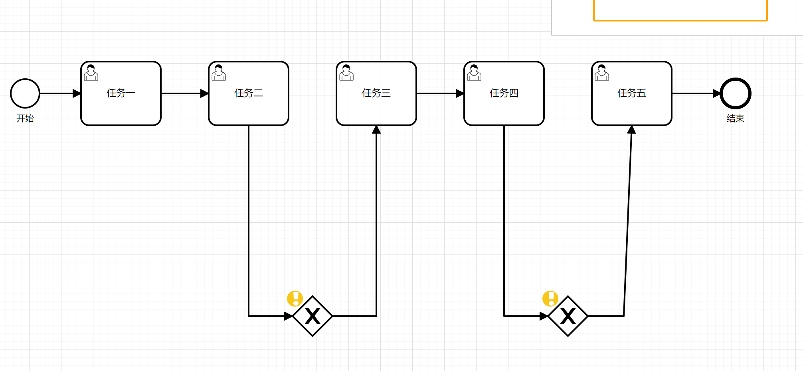
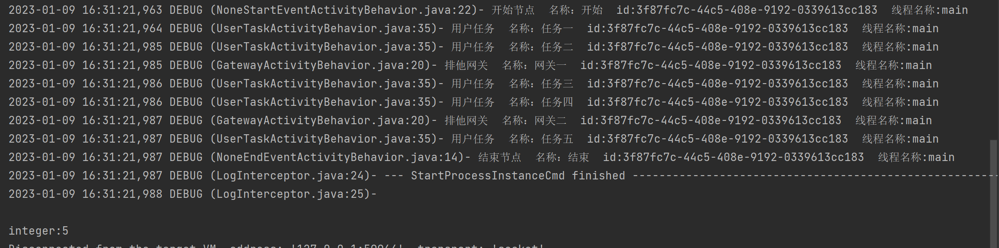

**目前处于Beta版本，因此不建议用到正式环境！！！**
欢迎大家提Issues，看到后我会回复的
## 1. `runflow`是什么
runflow是一个基于逻辑流转的轻量级流程引擎。
runflow支持BPMN规范，能够把复杂的业务逻辑可视化。开发人员可以通过流程编辑器设计自己的业务流程，为业务设计人员与开发工程师架起一座桥梁。
## 2. 特性
**规则轻量**：只要稍微了解bmpn规范的人员就快速上手。三分钟入门，一看既懂。
**丰富业务场景**：支持排他网关，并行网关。可以应用到各种业务场景。
**多线程编排**：通过并行网关与异步任务，可以对多线程进行编排。
**流程设计**：支持导入导出，可视化编辑流程图
## 3. 界面

###### **排他网关**

###### **并行网关**

###### **调用活动**

## 4. 快速开始
### Step1: 引入`POM`文件
~~~
<dependency>
  <groupId>com.runflow</groupId>
  <artifactId>runflow</artifactId>
  <version>0.0.1-Beta</version>
</dependency>
~~~
### Step2: 流程
#### S2.1: 流程设计
建议用定制的 http://123.249.93.130/runflow/ 在线设计流程

五个任务串行执行

~~~
<?xml version="1.0" encoding="UTF-8"?>
<bpmn2:definitions xmlns:xsi="http://www.w3.org/2001/XMLSchema-instance" xmlns:bpmn2="http://www.omg.org/spec/BPMN/20100524/MODEL" xmlns:bpmndi="http://www.omg.org/spec/BPMN/20100524/DI" xmlns:dc="http://www.omg.org/spec/DD/20100524/DC" xmlns:di="http://www.omg.org/spec/DD/20100524/DI" xmlns:activiti="http://activiti.org/bpmn" id="diagram_Process_1671936597549" targetNamespace="http://activiti.org/bpmn">
<bpmn2:process id="Process_1671936597549" name="业务流程_1671936597549" isExecutable="true">
<bpmn2:startEvent id="Event_0xovk1v" name="开始">
<bpmn2:outgoing>Flow_12bo28y</bpmn2:outgoing>
</bpmn2:startEvent>
<bpmn2:userTask id="Activity_1hw5c91" name="任务一" activiti:skipExpression="${a.incrementAndGet()}">
<bpmn2:incoming>Flow_12bo28y</bpmn2:incoming>
<bpmn2:outgoing>Flow_16ypfbk</bpmn2:outgoing>
</bpmn2:userTask>
<bpmn2:sequenceFlow id="Flow_12bo28y" sourceRef="Event_0xovk1v" targetRef="Activity_1hw5c91" />
<bpmn2:userTask id="Activity_0bsei7v" name="任务二" activiti:skipExpression="${a.incrementAndGet()}">
<bpmn2:incoming>Flow_16ypfbk</bpmn2:incoming>
<bpmn2:outgoing>Flow_0m8i3dp</bpmn2:outgoing>
</bpmn2:userTask>
<bpmn2:sequenceFlow id="Flow_16ypfbk" sourceRef="Activity_1hw5c91" targetRef="Activity_0bsei7v" />
<bpmn2:userTask id="Activity_053zx4p" name="任务三" activiti:skipExpression="${a.incrementAndGet()}">
<bpmn2:incoming>Flow_0l5pskm</bpmn2:incoming>
<bpmn2:outgoing>Flow_1pp2lec</bpmn2:outgoing>
</bpmn2:userTask>
<bpmn2:userTask id="Activity_17y9tbx" name="任务四" activiti:skipExpression="${a.incrementAndGet()}">
<bpmn2:incoming>Flow_1pp2lec</bpmn2:incoming>
<bpmn2:outgoing>Flow_15xyj1a</bpmn2:outgoing>
</bpmn2:userTask>
<bpmn2:sequenceFlow id="Flow_1pp2lec" sourceRef="Activity_053zx4p" targetRef="Activity_17y9tbx" />
<bpmn2:userTask id="Activity_1k2z9mj" name="任务五" activiti:skipExpression="${a.incrementAndGet()}">
<bpmn2:incoming>Flow_0zbyl2u</bpmn2:incoming>
<bpmn2:outgoing>Flow_03tjqju</bpmn2:outgoing>
</bpmn2:userTask>
<bpmn2:endEvent id="Event_0hhj9x1" name="结束">
<bpmn2:incoming>Flow_03tjqju</bpmn2:incoming>
</bpmn2:endEvent>
<bpmn2:sequenceFlow id="Flow_03tjqju" sourceRef="Activity_1k2z9mj" targetRef="Event_0hhj9x1" />
<bpmn2:exclusiveGateway id="Gateway_0tz2ciz" name="网关一">
<bpmn2:incoming>Flow_0m8i3dp</bpmn2:incoming>
<bpmn2:outgoing>Flow_0l5pskm</bpmn2:outgoing>
</bpmn2:exclusiveGateway>
<bpmn2:sequenceFlow id="Flow_0m8i3dp" sourceRef="Activity_0bsei7v" targetRef="Gateway_0tz2ciz" />
<bpmn2:sequenceFlow id="Flow_0l5pskm" sourceRef="Gateway_0tz2ciz" targetRef="Activity_053zx4p" />
<bpmn2:exclusiveGateway id="Gateway_1vyqjna" name="网关二">
<bpmn2:incoming>Flow_15xyj1a</bpmn2:incoming>
<bpmn2:outgoing>Flow_0zbyl2u</bpmn2:outgoing>
</bpmn2:exclusiveGateway>
<bpmn2:sequenceFlow id="Flow_15xyj1a" sourceRef="Activity_17y9tbx" targetRef="Gateway_1vyqjna" />
<bpmn2:sequenceFlow id="Flow_0zbyl2u" sourceRef="Gateway_1vyqjna" targetRef="Activity_1k2z9mj" />
</bpmn2:process>
<bpmndi:BPMNDiagram id="BPMNDiagram_1">
<bpmndi:BPMNPlane id="BPMNPlane_1" bpmnElement="Process_1671936597549">
<bpmndi:BPMNEdge id="Flow_0zbyl2u_di" bpmnElement="Flow_0zbyl2u">
<di:waypoint x="955" y="510" />
<di:waypoint x="1000" y="510" />
<di:waypoint x="1010" y="270" />
</bpmndi:BPMNEdge>
<bpmndi:BPMNEdge id="Flow_15xyj1a_di" bpmnElement="Flow_15xyj1a">
<di:waypoint x="850" y="270" />
<di:waypoint x="850" y="510" />
<di:waypoint x="905" y="510" />
</bpmndi:BPMNEdge>
<bpmndi:BPMNEdge id="Flow_0l5pskm_di" bpmnElement="Flow_0l5pskm">
<di:waypoint x="635" y="510" />
<di:waypoint x="690" y="510" />
<di:waypoint x="690" y="270" />
</bpmndi:BPMNEdge>
<bpmndi:BPMNEdge id="Flow_0m8i3dp_di" bpmnElement="Flow_0m8i3dp">
<di:waypoint x="530" y="270" />
<di:waypoint x="530" y="510" />
<di:waypoint x="585" y="510" />
</bpmndi:BPMNEdge>
<bpmndi:BPMNEdge id="Flow_03tjqju_di" bpmnElement="Flow_03tjqju">
<di:waypoint x="1060" y="230" />
<di:waypoint x="1122" y="230" />
</bpmndi:BPMNEdge>
<bpmndi:BPMNEdge id="Flow_1pp2lec_di" bpmnElement="Flow_1pp2lec">
<di:waypoint x="740" y="230" />
<di:waypoint x="800" y="230" />
</bpmndi:BPMNEdge>
<bpmndi:BPMNEdge id="Flow_16ypfbk_di" bpmnElement="Flow_16ypfbk">
<di:waypoint x="420" y="230" />
<di:waypoint x="480" y="230" />
</bpmndi:BPMNEdge>
<bpmndi:BPMNEdge id="Flow_12bo28y_di" bpmnElement="Flow_12bo28y">
<di:waypoint x="268" y="230" />
<di:waypoint x="320" y="230" />
</bpmndi:BPMNEdge>
<bpmndi:BPMNShape id="Event_0xovk1v_di" bpmnElement="Event_0xovk1v">
<dc:Bounds x="232" y="212" width="36" height="36" />
<bpmndi:BPMNLabel>
<dc:Bounds x="239" y="255" width="23" height="14" />
</bpmndi:BPMNLabel>
</bpmndi:BPMNShape>
<bpmndi:BPMNShape id="Activity_1hw5c91_di" bpmnElement="Activity_1hw5c91">
<dc:Bounds x="320" y="190" width="100" height="80" />
</bpmndi:BPMNShape>
<bpmndi:BPMNShape id="Activity_0bsei7v_di" bpmnElement="Activity_0bsei7v">
<dc:Bounds x="480" y="190" width="100" height="80" />
</bpmndi:BPMNShape>
<bpmndi:BPMNShape id="Activity_053zx4p_di" bpmnElement="Activity_053zx4p">
<dc:Bounds x="640" y="190" width="100" height="80" />
</bpmndi:BPMNShape>
<bpmndi:BPMNShape id="Activity_17y9tbx_di" bpmnElement="Activity_17y9tbx">
<dc:Bounds x="800" y="190" width="100" height="80" />
</bpmndi:BPMNShape>
<bpmndi:BPMNShape id="Activity_1k2z9mj_di" bpmnElement="Activity_1k2z9mj">
<dc:Bounds x="960" y="190" width="100" height="80" />
</bpmndi:BPMNShape>
<bpmndi:BPMNShape id="Event_0hhj9x1_di" bpmnElement="Event_0hhj9x1">
<dc:Bounds x="1122" y="212" width="36" height="36" />
<bpmndi:BPMNLabel>
<dc:Bounds x="1129" y="255" width="22" height="14" />
</bpmndi:BPMNLabel>
</bpmndi:BPMNShape>
<bpmndi:BPMNShape id="Gateway_0tz2ciz_di" bpmnElement="Gateway_0tz2ciz" isMarkerVisible="true">
<dc:Bounds x="585" y="485" width="50" height="50" />
<bpmndi:BPMNLabel>
<dc:Bounds x="594" y="542" width="33" height="14" />
</bpmndi:BPMNLabel>
</bpmndi:BPMNShape>
<bpmndi:BPMNShape id="Gateway_1vyqjna_di" bpmnElement="Gateway_1vyqjna" isMarkerVisible="true">
<dc:Bounds x="905" y="485" width="50" height="50" />
<bpmndi:BPMNLabel>
<dc:Bounds x="914" y="542" width="33" height="14" />
</bpmndi:BPMNLabel>
</bpmndi:BPMNShape>
</bpmndi:BPMNPlane>
</bpmndi:BPMNDiagram>
</bpmn2:definitions>
~~~
把生成的bpmn格式的文件放到resouces里面

#### S2.2: 调用流程

bpmn文件中 五个任务中el表达式都是a.incrementAndGet()，因此要把对象a放进去

##### S2.2.1: 调用流程(单元测试)
`    ProcessEngineConfigurationImpl conf = new ProcessEngineConfigurationImpl();
RunTimeServiceImpl runTimeService;

    {
        //初始化
        conf.init();
        runTimeService = conf.getRunTimeService();
        //bpmn位置
        conf.addPath("/bpmn/demo1.bpmn");
    }

    @Test
    public void demo1() {
        //a.incrementAndGet()
        AtomicInteger integer = new AtomicInteger(0);
        Map map = new HashMap();
        map.put("a", integer);
        runTimeService.startWorkflow("Process_1671936597549", map);
        System.out.println(integer);
    }
`
直接运行即可

##### S2.2.2: 调用流程(springboot)

springboot 和单元测试的差不多，不同的是增加SpringBeanELResolver类，这个类可以去beanFactory中搜索对应的bean（通过名称）

比如el表达式中可以直接${userService.methodA()}调用userService中的methodA

配置类

`@Configuration
public class RunFlowConfig {
@Autowired
ProcessEngineConfigurationImpl processEngineConfiguration;

    @Autowired
    BeanFactory beanFactory;

    @Bean
    public ProcessEngineConfigurationImpl createProcessEngineConfiguration() {
        ProcessEngineConfigurationImpl conf = new ProcessEngineConfigurationImpl();
        conf.customResolver(new SpringBeanELResolver());
        conf.init();//一定要初始化
        conf.addPath("/bpmn/demo1.bpmn");
        return conf;
    }

    @Bean
    public RunTimeServiceImpl createRunTimeService() {
        return processEngineConfiguration.getRunTimeService();
    }

    /**
     * 配置spring的el解析器，更方便寻找bean
     */
    class SpringBeanELResolver extends ELResolver {
        protected final Log logger = LogFactory.getLog(this.getClass());

        public SpringBeanELResolver() {
        }

        public Object getValue(ELContext elContext, Object base, Object property) throws ELException {
            if (base == null) {
                String beanName = property.toString();
                if (beanFactory.containsBean(beanName)) {
                    if (this.logger.isTraceEnabled()) {
                        this.logger.trace("Successfully resolved variable '" + beanName + "' in Spring BeanFactory");
                    }
                    elContext.setPropertyResolved(true);
                    return beanFactory.getBean(beanName);
                }
            }

            return null;
        }

        public Class<?> getType(ELContext elContext, Object base, Object property) throws ELException {
            if (base == null) {
                String beanName = property.toString();
                if (beanFactory.containsBean(beanName)) {
                    elContext.setPropertyResolved(true);
                    return beanFactory.getType(beanName);
                }
            }

            return null;
        }

        public void setValue(ELContext elContext, Object base, Object property, Object value) throws ELException {
            if (base == null) {
                String beanName = property.toString();
                if (beanFactory.containsBean(beanName)) {
                    if (value != beanFactory.getBean(beanName)) {
                        throw new PropertyNotWritableException("Variable '" + beanName + "' refers to a Spring bean which by definition is not writable");
                    }

                    elContext.setPropertyResolved(true);
                }
            }

        }

        public boolean isReadOnly(ELContext elContext, Object base, Object property) throws ELException {
            if (base == null) {
                String beanName = property.toString();
                if (beanFactory.containsBean(beanName)) {
                    return true;
                }
            }

            return false;
        }

        public Class<?> getCommonPropertyType(ELContext arg0, Object arg1) {
            return Object.class;
        }

        public Iterator<FeatureDescriptor> getFeatureDescriptors(ELContext arg0, Object arg1) {
            return null;
        }

    }

}`

把上面的bpmn中的 ${a.incrementAndGet()} 全部替换为 ${demo1Service.incrementAndGet(integer)}

`    @Autowired
RunTimeServiceImpl runTimeService;

    @GetMapping("/demo1")
    public Integer demo1(){
        AtomicInteger integer = new AtomicInteger(0);
        Map map = new HashMap();
        map.put("integer",integer);
        runTimeService.startWorkflow("Process_1671936597549",map);
        System.out.println(integer.get());
        return integer.get();
    }

    /**
     * 生成图片
     * @param key
     * @param response
     * @throws IOException
     */
    @GetMapping("/images")
    public void images(String key, HttpServletResponse response) throws IOException {
        InputStream inputStream = runTimeService.generaImages(key);
        IOUtils.copy(inputStream, response.getOutputStream());
    }
`

