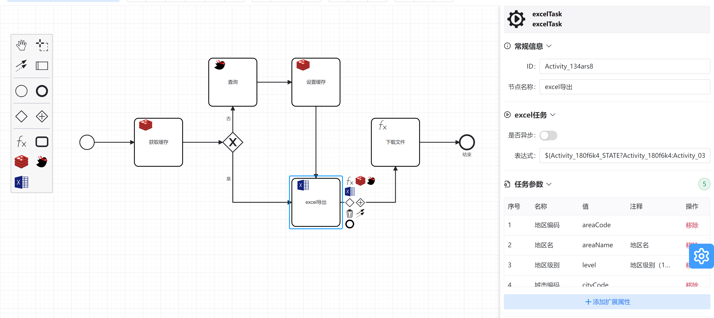
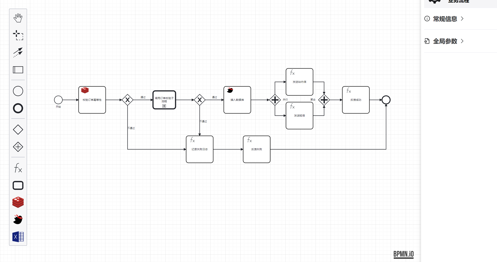
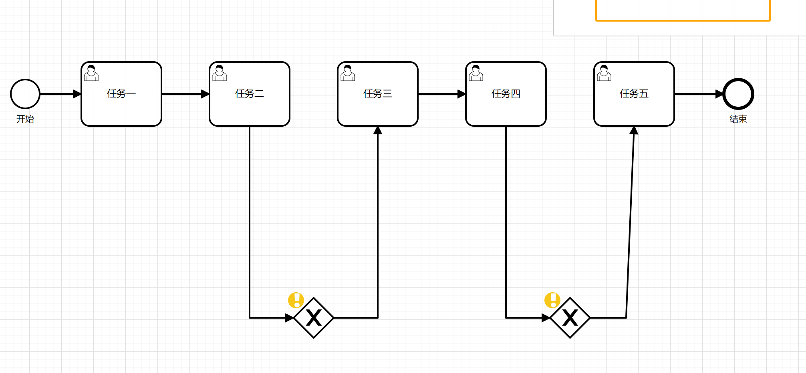

欢迎大家提Issues，看到后我会回复的

## 1. `runflow`是什么
runflow是一个基于逻辑流转的无状态轻量级流程引擎。
runflow支持BPMN规范，能够把复杂的业务逻辑可视化。开发人员可以通过流程编辑器设计自己的业务流程，为业务设计人员与开发工程师架起一座桥梁。
## 2. 特性
- **规则轻量**：只要稍微了解bmpn规范的人员就快速上手。三分钟入门，一看既懂。
- **丰富业务场景**：支持排他网关，并行网关。可以应用到各种业务场景。
- **多线程编排**：通过并行网关与异步任务，可以对多线程进行编排。
- **流程设计**：支持导入导出，可视化编辑流程图
- **插件功能**：提供redis，excel和mybatis插件，并拥有自定义插件拓展

## 3. 界面

###### **自定义插件**

[excel插件](plugin/runflow-plugin-excel)

[redis插件](plugin/runflow-plugin-redis)

[mybatis插件](plugin/runflow-plugin-mybatis)

###### **简化版下单逻辑**

## 4. runflow设计初衷
一个功能刚开始比较简单，随着后面的不断迭代完善，功能越来越复杂。

比如下单功能，刚开始功能只是 验证必填项-库存预占-生成订单，

后面经过一年的不断迭代变成了 验证必填项-用户校验-风控校验-拆单-优惠信息-库存预占-生成订单（真实步骤远比这些多，这里简化了）

假设在接着迭代功能，看着动辄几千行的的代码，开发的小伙伴一定头皮发麻吧。产品的小伙伴也不好受，需要重新梳理流程步骤。

在这种情况下，runflow诞生了，可以图形化编排任务，对于开发来说，代码拆分成一个个步骤，更方便维护。产品也可以直接看流程图，更高效的进行设计。

## 5. runflow与activiti，flowable的区别
**activiti，flowable 是基于角色任务流转的，runflow是基于逻辑流转的。**

比如 订单流程 下单-审核-发货-确认收货。

activiti，flowable可以控制整个订单流程的运转。

runflow擅长控制下单流程里面的某个任务里面的步骤，比如订单流程里面的 下单有 验证必填项-用户校验-风控校验-拆单-优惠信息-库存预占-生成订单 七个步骤
runflow可以对里面的步骤进行编排。

## 6. 快速开始
### Step1: 流程
#### S1.1: 流程设计

有一个五个任务串行执行的流程图demo1

下载文件：[demo1.bpmn](static/bpmn/demo1.bpmn) 放到resouces里面

目录结构如下

也可以用 http://123.249.93.130/runflow/ 在线设计自己的流程

#### S1.2: build

目前还没有上传到maven中央仓库，因此需要下载源码 安装到本地仓库

~~~
git clone https://github.com/songhongtu/runflow.git

mvn -Dmaven.test.failure.ignore=true clean install

~~~

#### S2.1: 调用流程(jar包方式)

##### 2.1.1: 引入`POM`文件
~~~
<dependency>
    <groupId>com.runflow</groupId>
    <artifactId>runflow-core</artifactId>
    <version>0.0.2-Beta</version>
</dependency>
~~~

##### 2.1.2: 调用流程
~~~
    ProcessEngineConfigurationImpl conf = new ProcessEngineConfigurationImpl();
    RunTimeServiceImpl runTimeService;

    {
        //初始化
        conf.init();
        runTimeService = conf.getRunTimeService();
        //bpmn位置
        conf.addPath("/bpmn/demo1.bpmn");
    }

    @Test
    public void demo1() {
        //a.incrementAndGet()
        AtomicInteger integer = new AtomicInteger(0);
        Map map = new HashMap();
        map.put("a", integer);
        runTimeService.startWorkflow("Process_1671936597549", map);
        System.out.println(integer);
    }
~~~
直接运行即可

#### S3.1: 调用流程(springboot方式)

##### 3.1.1: 引入`POM`文件
~~~
<dependency>
    <groupId>com.runflow</groupId>
    <artifactId>runflow-spring-boot-starters</artifactId>
    <version>0.0.2-Beta</version>
</dependency>
~~~

##### 3.1.2: 调用流程
~~~
   @Autowired
   RunTimeServiceImpl runTimeService;
   
    @GetMapping("/demo1")
    public Integer demo1(){
        AtomicInteger integer = new AtomicInteger(0);
        Map map = new HashMap();
        map.put("a", integer);
        runTimeService.startWorkflow("Process_1671936597549",map);
        System.out.println(integer.get());
        return integer.get();
    }
~~~

## 7.项目结构

~~~
runflow-core                                               [核心模块]
runflow-spring                                             [spring模块]
runflow-spring-boot-starters                               [springboot模块]
plugin/runflow-plugin-redis                                [redis插件]
plugin/runflow-plugin-mybatis                              [mybatis插件]
plugin/runflow-plugin-excel                                [excel插件]
runflow-springboot-demo                                    [springboot例子]
runflow-web                                                [在线设计器]

~~~

> 欢迎提出更好的意见，帮助完善 runflow

