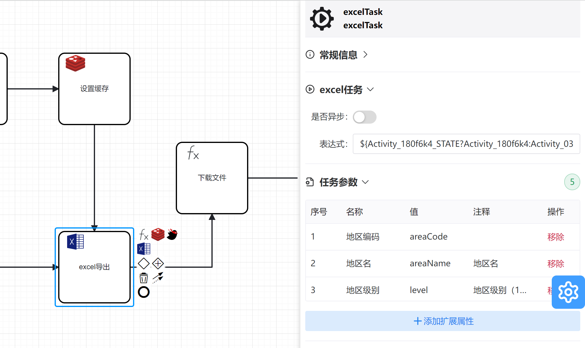

# **redis插件**
**关于例子可以参考[runflow-springboot-demo](../../runflow-springboot-demo)项目的DownloadController.download**

该插件依赖于poi，需要引入对应的依赖

**功能正在不断丰富中。。。欢迎大家 提issues**

**改插件核心源码 可以看 ExcelTaskBehavior.java(一看就懂!!!)**

###  bpmn文件
具体文件参考[runflow-springboot-demo](../../runflow-springboot-demo)项目的download.bpmn

###  属性栏

| 名称 | 值     |解释 |
|:--------:| :-------------:| :-------------:|
| 表达式 | ${Activity_180f6k4_STATE?Activity_180f6k4:Activity_03ng5a5} | excel的list对象|
| 任务参数 |  |  |
| 任务参数1地区编码 | areaCode |名称 excel表头，值表示表达式对应的list对象中的每一个对象的属性  |
|任务参数2地区名 | areaName | 名称 excel表头，值表示表达式对应的list对象中的每一个对象的属性 |
|任务参数3地区级别 | level | 名称 excel表头，值表示表达式对应的list对象中的每一个对象的属性 |
|任务参数4城市编码 | cityCode | 名称 excel表头，值表示表达式对应的list对象中的每一个对象的属性 |
|任务参数5地区父节点| parentId | 名称 excel表头，值表示表达式对应的list对象中的每一个对象的属性 |