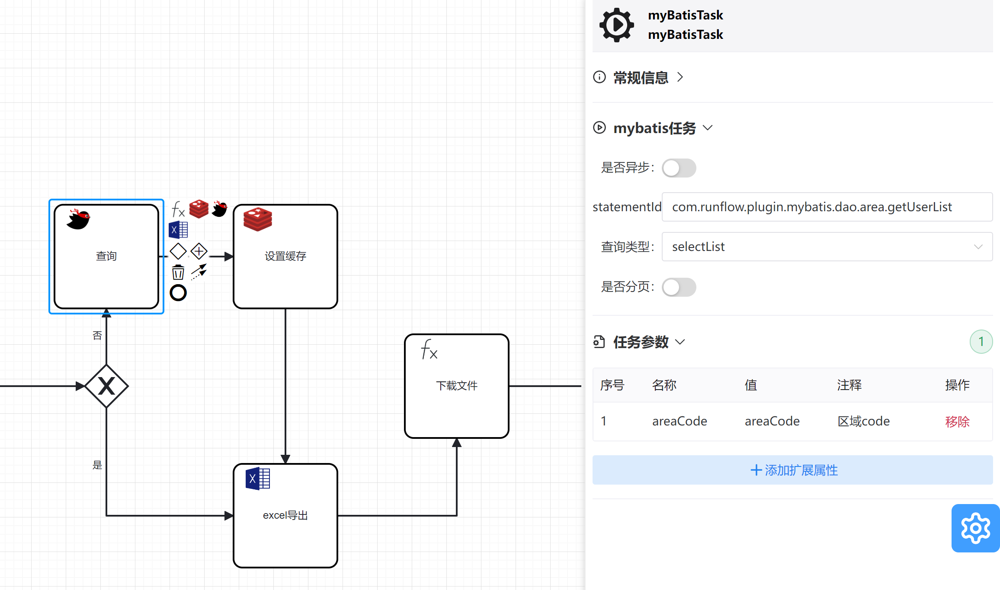

# **mybatis插件**
**关于例子可以参考runflow-springboot-demo项目的DownloadController.download**

该插件依赖于mybatis，需要引入对应的依赖和配置文件.

**功能正在不断丰富中。。。欢迎大家 提issues**

**改插件核心源码 可以看 MybatisTaskBehavior.java(一看就懂!!!)**

###  bpmn文件
具体文件参考runflow-springboot-demo项目的download.bpmn

###  属性栏

| 名称 | 值     |解释 |
|:--------:| :-------------:| :-------------:|
| statementId | com.runflow.plugin.mybatis.dao.area.getUserList | mapper文件中的 namespace+id|
| 查询类型 | SELECTLIST |下拉框的属性对应mapper文件中的SELECT，UPDATE，INSERT，DELETE标签  |
| 是否分页 | 否 |分页参数，如果开启分页后，会调用 PageHelper.startPage 进行分页  |
| 当前页 |  是否分页为是展示| 分页参数 |
| 分页大小 | 是否分页为是展示 |分页参数  |
| 任务参数 |  |  |
| 任务参数1 areaCode | 区域code | mybatis 动态sql参数|