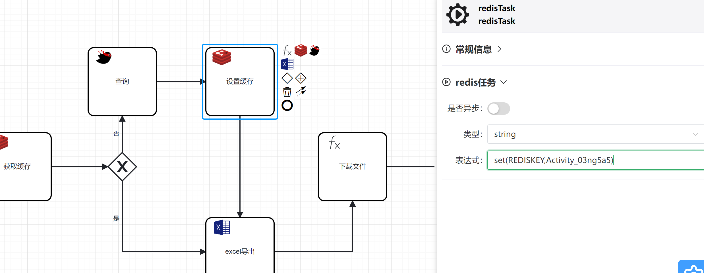

# **redis插件**
**关于例子可以参考[runflow-springboot-demo](../../runflow-springboot-demo)项目的DownloadController.download**

该插件依赖于redis，需要引入对应的依赖和配置文件.

**功能正在不断丰富中。。。欢迎大家 提issues**

**改插件核心源码 可以看 RedisTaskBehavior.java,RedisContextElResolver.java(一看就懂!!!)**

###  bpmn文件
具体文件参考[runflow-springboot-demo](../../runflow-springboot-demo)项目的download.bpmn

###  属性栏

| 名称 | 值     |解释 |
|:--------:| :-------------:| :-------------:|
| 类型 | STRING |下拉框的属性对应redis五种数据类型  |
| 表达式 | set(REDISKEY,Activity_03ng5a5) |根据上面的类型获取对应的对象  RedisContextElResolver.getObjByEnumString , 然后调用表达式的方法|