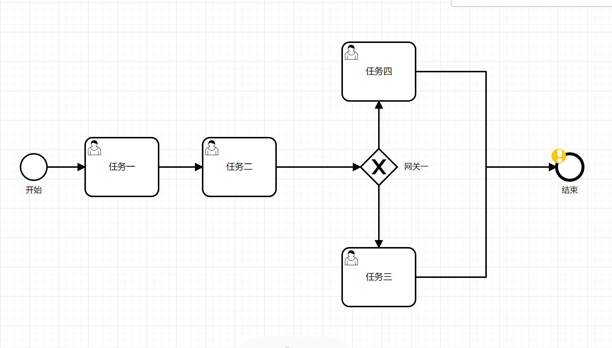
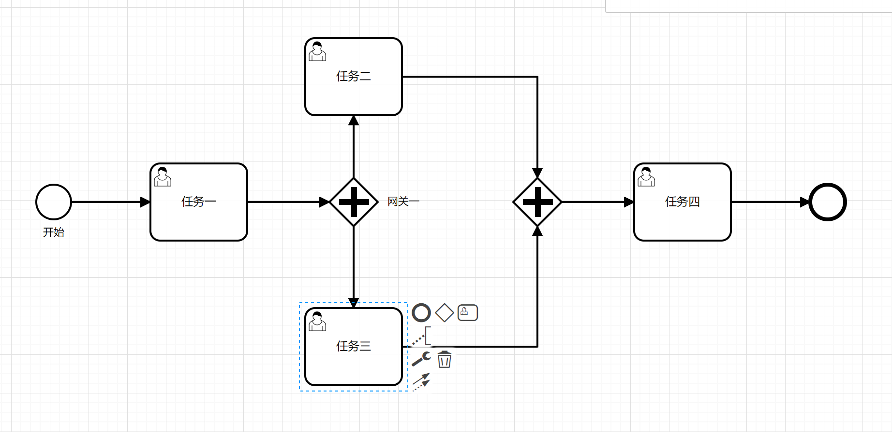

**runflow上手很简单，只要掌握基础的bmpn设计基础，看完下面的demo后就能很快上手**

## demo

### demo1 （排他网关）

在resouces里面目录里面有文件：[demo1.bpmn](./src/main/resources/bpmn/demo1.bpmn) 

如下图所示

建议用 http://123.249.93.130/runflow/ 在线设计自己的流程

调用该流程

~~~
@RestController
public class Demo1Controller {
@Autowired
private RunTimeServiceImpl runTimeService;
@GetMapping("/demo1")

public Object demo1() throws JsonProcessingException {
    //Process_16719365975 是bpmn 文件中的  process id="Process_16719365975"
    ExecutionEntityImpl executionEntity = runTimeService.startWorkflow("Process_16719365975");
    return executionEntity.getVariableInstances();  //返回json 为 {"Activity_1hw5c91":2,"Activity_053zx4p":4,"Activity_0bsei7v":3,"Gateway_0tz2ciz":true}
}
}

@Service("demo1")
public class Demo1Service {
    public Integer add(Integer a) {
        return a + 1;
    }
}
~~~

[demo1.bpmn](./src/main/resources/bpmn/demo1.bpmn) 主要说明

| 名称  | id  |表达式 | 说明    |
|---|---|---|---|
| 任务一  |  Activity_1hw5c91 |  ${demo1.add(1)}  | 调用 Demo1Service.add ，参数为 1。任务一返回值是2。  |  
| 任务二  |  Activity_0bsei7v | ${demo1.add(Activity_1hw5c91)}   |  调用 Demo1Service.add， 参数为 任务一的返回值 。任务二的返回值是3。  |
| 网关一  | Gateway_0tz2ciz  |  无  |  无   |
| 任务三 |  Activity_053zx4p | ${demo1.add(Activity_0bsei7v)}   |  调用 Demo1Service.add， 参数为 任务二的返回值 。   |
| 任务四  |  Activity_17y9tbx | ${demo1.add(Activity_0bsei7v)}   |  调用 Demo1Service.add， 参数为 任务四的返回值 。   |
| 线一（网关一>任务三）  | Flow_12vlfum  |  ${Activity_0bsei7v==3}  | Activity_0bsei7v==3 结果为true  向下执行。  |
| 线二（网关一>任务四）  |Flow_0wtdfcr   |  ${Activity_0bsei7v==4}  | Activity_0bsei7v==3 结果为false，不执行。    |

**注意：任务节点的返回值可以是任意类型或者为空，线中的条件必须是boolean类型或者是为空（条件为空，默认执行在bpmn中声明中的第一条线）**

### demo2 （并行网关）

在resouces里面目录里面有文件：[demo2.bpmn](./src/main/resources/bpmn/demo2.bpmn) 

建议用 http://123.249.93.130/runflow/ 在线设计自己的流程

其中任务二与任务三并行执行，最后由任务四汇总起来

~~~
@RestController
public class Demo2Controller {
    @Autowired
    private RunTimeServiceImpl runTimeService;
    @GetMapping("/demo2")
    public Map<String, Object> demo2() {
        AtomicInteger integer = new AtomicInteger(0);
        Map initMap = new HashMap();
        initMap.put("integer", integer);
        //Process_16719365976 是bpmn 文件中的  process id="Process_16719365976"
        ExecutionEntityImpl executionEntity = runTimeService.startWorkflow("Process_16719365976", initMap);
        return executionEntity.getVariableInstances();
    }
}

@Service("demo2")
public class Demo2Service {
    public Integer add(AtomicInteger integer) throws InterruptedException {
        //模拟真实环境休眠
        Thread.sleep(RandomUtils.nextInt(0, 1000));
        return integer.incrementAndGet();
    }
}
~~~

| 名称  | id  |表达式 | 说明    |是否异步 |
|---|---|---|---|---|
| 任务一  |  Activity_1hw5c91 |  ${demo2.add(integer)}  | 调用 Demo2Service.add ，参数为  启动流程传入的 key 为 integer 的值。 | false |  
| 任务二  |  Activity_17y9tbx | ${demo2.add(integer)}   |  调用 Demo2Service.add， 参数为 启动流程传入的 key 为 integer 的值 。 |false|  
| 网关一  | Gateway_0tz2ciz  |  无  |  无   |
| 任务三 |  Activity_053zx4p | ${demo2.add(integer)}   |  调用 Demo2Service.add， 参数为 启动流程传入的 key 为 integer 的值 。   |true|  
| 任务四  |  Activity_1uaa0hi | ${demo2.add(integer)}   |  调用 Demo2Service.add， 参数为 启动流程传入的 key 为 integer 的值 。   |true|  
| 线一（网关一>任务二）  | Flow_0wtdfcr  | 无  |  无  |
| 线二（网关一>任务三）  |Flow_12vlfum   | 无  |  无    |

**注意：是否异步 属性 只在并行网关里面分离的任务中有效**